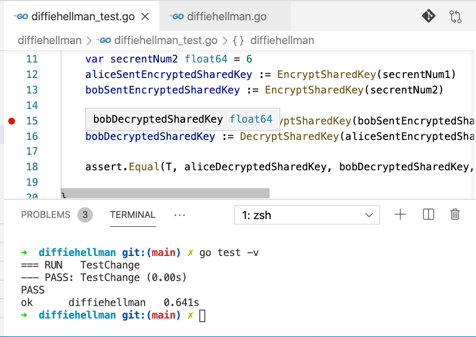

# CSYE6225 Assignment 1.1 Go Lang exercise

## Save password encrypted data (AES) in AWS S3
```bash
cd encrypts3
go test
```


## Diffie hellman key exchange
```bash
cd diffiehellman
go test -v
```


## AWS ElastiCache for fast key-record fetching
